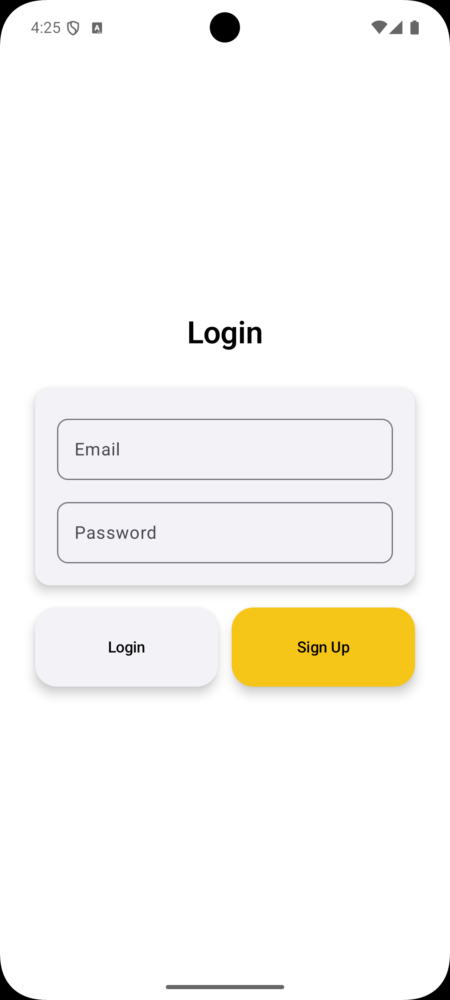
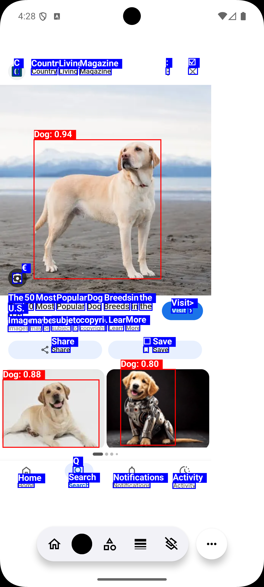
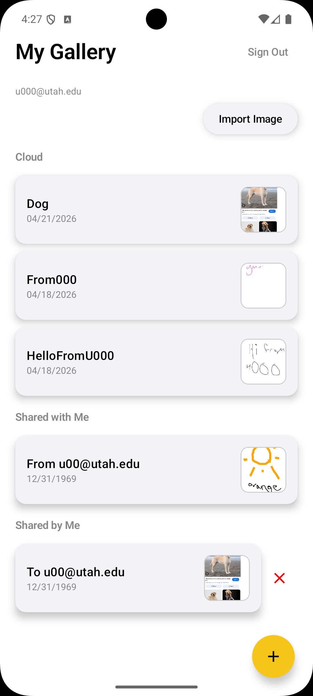

# AI-Drawing-Application

This project is a modern Android drawing application built with Jetpack Compose. Users can create sketches on a custom canvas, analyze their work using Google Vision API, and share drawings with friends via a cloud-based gallery system.

| Authentication Screen | AI Analysis | Gallery |
| :---: | :---: | :---: |
|  |  |  |

# Key Features
- Custom Canvas Engine: A responsive drawing interface supporting various strokes and colors built on Jetpack Compose.

- AI Image Analysis: Integrated with Google Vision API to identify objects within sketches and provide visual analysis.

- Cloud Storage & Sync: Powered by Firebase Firestore, allowing users to save drawings and access them from any device.

- Social Sharing System: Real-time sharing/unsharing logic using email identifiers to collaborate with other users.

- Modern MVVM Architecture: Built using clean architecture principles, Coroutines, and ViewModel for high performance and stability.

# Setup
1. Clone repo.
2. Create Firebase project and add your own google-services.json to the app/ folder.
3. Add your own Google Vision API key to your local environment/BuildConfig
4. Build and run!
